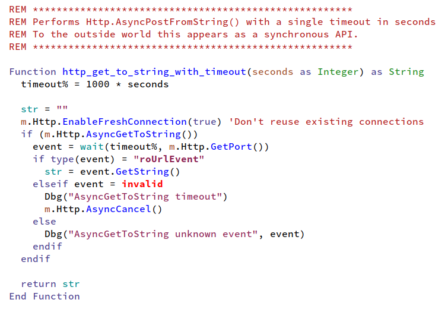

# Brightscript mode for Emacs

[](https://melpa.org/#/brightscript-mode)

Major emacs mode for editing brightscript files from Brightsign and Roku devices.

Features include syntax highlighting and indentation.



## Installation
The package is available on MELPA. Run the following to set it up:

```
M-x package-install brightscript-mode
```

Then add the following lines to your emacs init file:

```elisp
(require 'brightscript-mode)
(add-to-list 'auto-mode-alist '("\\.brs\\'" . brightscript-mode))
```

### Manual installation

Clone this repo or download "brightscript-mode.el" and then reference it in your config file:

```elisp
(add-to-list 'load-path "/path/to/brightscript-mode.el")
```

## Configuration

Indentation defaults to two spaces. Change `brightscript-mode-indent-offset` to adjust this value:

```elisp
(setq brightscript-mode-indent-offset 4)
```

## License

This is free software, licensed under GPLv3.
